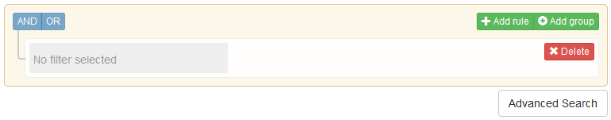

This section provides some examples on how to use the advanced search facilities provided by the [YourDataStories](http://platform.yourdatastories.eu/content/tabbed-search) (YDS) application. A series of "tabs" are presented to the user, representing categories of data available through the YDS platform. Each "tab" has a search field, where the user can use to perform searches within the category represented by the "tab".

In order to access the advanced search, the user has to click on the link "Show Advanced Search", just below the "Search" button:

After "Show Advanced Search" is clicked, a new graphical element (UI) will appear, similar to the following one:

Through this graphical element you can create a set of "rules", which can be grouped, and connected with logical operators (such as "AND", "OR", "NOT") to form a complex logical expression, which can be used for searching within the data category represented by the "tab".

## Operator examples

When the value is of a string type, the following _wildcard_ characters can be used:

| Wildcard Search Type | Special Character | Example |
|----------------------|-------------------|---------|
| Single character (matches a single character) | ? | The search string __te\?t__ would match both test and text. [[\*]](https://cwiki.apache.org/confluence/display/solr/The+Standard+Query+Parser)|
| Multiple characters (matches zero or more sequential characters) | \* | The wildcard search __tes\*__ would match 'test', 'testing', and 'tester'. You can also use wildcard characters in the middle of a term. For example: __te\*t__ would match 'test' and 'text'. __\*est__ would match 'pest' and 'test'. [[\*]](https://cwiki.apache.org/confluence/display/solr/The+Standard+Query+Parser)|

The following table presents some examples for any operator offered by advanced search:

| Operator | value type: **string** | value type: **numerical** |
|----------|------------------------|---------------------------|
| __equal__    | If value is a single word, it can have wildcard characters. For example, __YourData\*__ will match 'YourDataStories'. In order to match the character '\*', you can use double quotes: "YourData\*" will match only 'YourData\*'.If value contains more than one words, separated by space, wildcard characters cannot be used (they are treated as normal characters, loosing their "wildcard"-iness).| A numerical value, such as __10__ or __3.14__ is expected. |
| __less__     | Not applicable. | Any numerical value, date, or time. The value is **excluded** from the results, i.e. data that match the value are not returned. |
| __less or equal__ | Not applicable. | Any numerical value, date, or time. The value is **included** in the results, i.e. data that match the value are returned. |
| **greater**     | Not applicable. | Any numerical value, date, or time. The value is **excluded** from the results, i.e. data that match the value are not returned. |
| **greater or equal** | Not applicable. | Any numerical value, date, or time. The value is **included** in the results, i.e. data that match the value are returned. |
| **between** | Not applicable. | Any two numerical values, dates, or times. The values are **included** in the results, i.e. the matched data are in the range **[value1, value2]**. |
| **begins with** | The value should be a single word, where the wildcard "\*" is added at the begining of the value. For example, "est" becomes "\*est". | Not applicable. |
| **ends with** | The value should be a single word, where the wildcard "\*" is appended at the end of the value. For example, "tes" becomes "tes\*". | Not applicable. |
| **contains** | One or more words (separated by spaces) are expected. All words must exist in the data in order to be matched, but each word does not need to appear next to the rest of the words. For example, "a the", will match data that contain both "a" and "the", in any position in the filed value. | Not applicable. |
| **is empty** | No value is expected. Matches the empty string. | Not applicable. |

The follwoing operators are identical to the corresponding operators already described, but they negate the returned result: Everything that does not match is returned.

| Negation Operators |  |
|--------------------|--------------------------------------------------------|
| **not equal** | Identical to operator __equal__, but data that do not match the rule are returned. |
| **not between** | Identical to operator __between__, but data that do not match the rule are returned. |
| **not begins with** | Identical to operator __begins with__, but data that do not match the rule are returned. |
| **not ends with** | Identical to operator __ends with__, but data that do not match the rule are returned. |
| **not contains** | Identical to operator __contains__, but data that do not match the rule are returned. |
| **is not empty** | Identical to operator __is empty__, but data that do not match the rule are returned. |

### References

The YDS Advanced Search is based on [Query Builder](http://querybuilder.js.org/).
